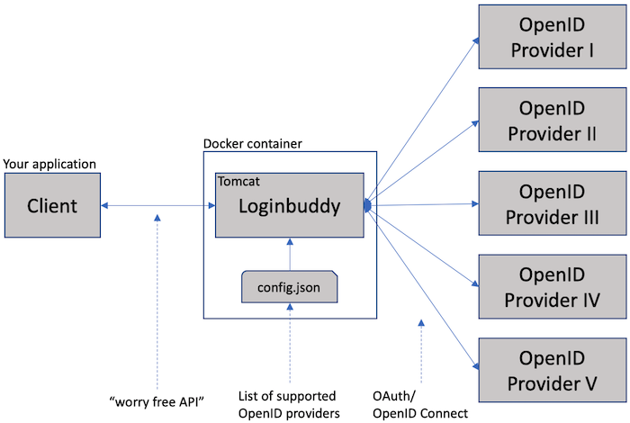

# About

A container based solution that helps developers support social login for their applications in a simple way!

The latest docker image is always available at [docker hub](https://hub.docker.com/r/saschazegerman/loginbuddy/).

A running version of the latest loginbuddy may be here: [http://latest.loginbuddy.net](http://latest.loginbuddy.net). (If the URL is not working, I am trying to figure out something new)

# Loginbuddy - Your authenticator

This project implements an OpenID Connect client that can be used as proxy between an application (your application) and 
an OpenID Provider. This is useful for cases where social login should be an option for users to login to your 
application. Your application needs to make two simple calls only and the response will be users details. Loginbuddy 
takes care of the complete OAuth/ OpenID Connect protocol.

This is the visual overview of the design:



# Getting started

## Running the latest and greatest container of Loginbuddy:

I have only used loginbuddy on a MacBook, if you run it on Windows, some instructions may need to be adjusted!

- Preparation
  - modify your hosts file, add **127.0.0.1 local.loginbuddy.net demoserver.loginbuddy.net democlient.loginbuddy.net**
  - for MacBooks this would be done at ```sudo /etc/hosts```
- Download or clone this project
  - ```git clone https://github.com/SaschaZeGerman/loginbuddy.git```
  - Switch into the directory *loginbuddy*
- Run ```docker-compose -f docker-compose-demosetup.yml up -d```
  - this will pull the latest demo image from docker hub
  - this will use ports 80 (http), 443 (https)
- Open a browser
  - go to **https://democlient.loginbuddy.net** and follow the prompts

The demo simulates a client, a social login provider (called 'fake') and uses loginbuddy!

The last page displays type of message loginbuddy would return to your client. (the window is very small. Copy the content, paste it into [JSONLINT](https://jsonlint.com) and click 'Validate JSON').

Since the demo uses self-signed certificates, confirm the SSL security screen in your browser.

# Current state

Please check the project page: [projects](https://github.com/SaschaZeGerman/loginbuddy/projects).

To find out more details on how to build and configure Loginbuddy, please visit the [WIKI](https://github.com/SaschaZeGerman/loginbuddy/wiki) pages!

# License

Copyright (c) 2019. All rights reserved.

This software may be modified and distributed under the terms of the Apache License 2.0 license. See the [LICENSE](/LICENSE) file for details.