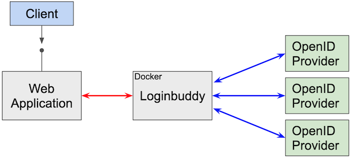

# About Loginbuddy 

**Latest update: 26. December 2022! See what has changed here: [WIKI](https://github.com/SaschaZeGerman/loginbuddy/wiki/Latest-and-Greatest)**

Loginbuddy is a container based solution that handles OpenID Connect flows and is used as proxy between an application (your application) and an OpenID Provider. Your application only needs to communicate with Loginbuddy. After finishing the authentication and authorization flow with providers, Loginbuddy generates a single response through a stable, normalized, interface to the application.

The high level design looks like this:

# Getting started 

To get started, checkout the [samples project](https://github.com/SaschaZeGerman/loginbuddy-samples) or visit the online version at [https://loginbuddy.net](https://loginbuddy.net).

Loginbuddy includes configuration templates for common OpenID providers which simplifies the configuration effort:

- Google
- GitHub
- LinkedIn
- Sign In with Apple
- PingOne (Ping Identity)
- Amazon (Login with Amazon)
- OpenID Dynamic registration
- self-issued

# API and Protocols 

Loginbuddy is built to support OpenID Connect and OAuth 2.0 specifications:

* OAuth 2.0
* OpenID Connect Core
* OpenID Connect Discovery
* OpenID Connect Dynamic Registration
* OAuth 2.0 Pushed Authorization Requests

For more details on the APIs supported see [WIKI - Protocols and APIs](https://github.com/SaschaZeGerman/loginbuddy/wiki/Protocols-and-APIs)

# Other Resources

The latest docker images are always available at [docker hub](https://hub.docker.com/search?q=loginbuddy&type=image).

To get a better idea how it works I have published a few videos about Loginbuddy on YouTube: [Loginbuddy playlist](https://www.youtube.com/playlist?list=PLcX_9uDXp_CR5vXTT8lxI94x7Esl8O78E)

# WIKI

All documentation for Loginbuddy can be found in the local [WIKI](https://github.com/SaschaZeGerman/loginbuddy/wiki/HOME)

# License

Copyright (c) 2022. All rights reserved.

This software may be modified and distributed under the terms of the Apache License 2.0 license. See the [LICENSE](/LICENSE) file for details.